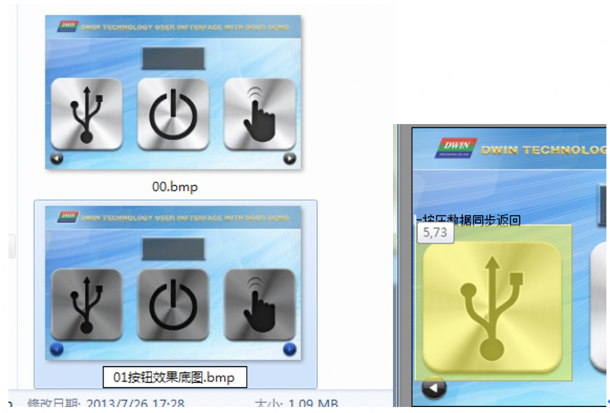

## DGUS屏触控控件问题

### **基本触控**

**问题1：**

按钮效果是什么意思？

**解决方法：**

按钮效果：点击屏幕的某触控按钮，按下去就变色，有一个按下去的效果，迪文屏的按钮效果原理是**加载非当前页的对应触控范围相同坐标区域图片底图**，软件直接设置指定的页面，注意：如果是在另外的底图放置一个显示控件，那个控件的显示是无法用按钮效果加载过来的。虽然设置的触控按钮都是方形区域的，但是底图的设计是自由的，按钮可以做出各种不同风格的效果，如下图的按钮效果示意图参考： 

**问题2：**

基本触控为什么不能传值？

**解决方法：**

基本触控只有放置到弹出菜单 或者弹出键盘数据录入才能根据其根地址传值，弹出菜单键值设置范围0000-00FE可以传值，其中00FF不传值（通常设置为关闭弹窗按键用于不需要传值的按钮）。

如果需要某个按键能直接点击后传值，请用按键返回或者增量调节。

 

**问题3：**

 触控能否叠加使用？

**解决方法：**

触控不能叠加，违背了DGUS屏的底层判断机制，软件生成的时候也会有提示交叉，无法生成编译，但对于DGUSII屏，滑动翻页功能的触控是可以和其他的触控叠加显示的。

 

 

 

**问题3：**

基本触控和按键返回有什么区别？

**解决方法：**

基本触控可以用于纯粹的页面切换动作，不会访问到任何地址，按键返回带了地址，可以传值。

 

### **按键返回**

**问题1：**

按键返回点击了之后不能传值，只有松开手才会传值出来。

**解决方法：**

按键返回的设置机理就是这样，只有松开手才会传值，如果想要点击后里面会传值，可以改用增量调节按钮代替按键返回，例如，按键返回设置地址10001，键值0010H，增量调节设置地址1001，步长16，上线16，下线16，和按键返回传值的协议是一样的。只是松开传值和点击就传值的机理不一样。按键返回按下了之后，地址里面就有了键值，不会主动清0。

 

### **增量调节**

**问题1：**

增量调节能调节长整数吗？

**解决方法：**

增量调节的上下线是在整数范围之内，只能调节一个地址字长，不能调节4个字节的长整数，可以单片机收到增量调节的步长值后，发指令到长整数的地址改变值，或者写os计算处理。

 

### **文本录入**

**问题1：**

文本录入后面为什么会影响到后面的地址？

**解决方法：**

文本录入之后会补齐FFFF 或者FF FFFF，表示结束符，文本显示的时候也可以效仿这个格式补齐字。比如发送123  5A A5 09 82+vp+ 3132 33FF FFFF ，因为变量地址的单位是字，83指令读的时候也是按照字操作的，所以建议用字的格式处理对齐。

 

**问题2：**

GBK录入怎么输入中文标点？

**解决方法：**

文本录入输入“bd”就可以选择标点。

 

**问题3：**

GBK录入怎么实现中英文混合录入。

**解决方法：**

确认按键0x00F1键值，是将文本输入之后进行录入到文本框，如果GBK录入的情况下输入拼音后，做一个回车按键0x0D0D，回车按键按下了就能使输入拼音自动输入到录入栏。所以这里通常用“回车按键”实现录入过程切换。

 

**问题4：**

ASCII录入怎么能直接录入大写字母，不需要先按下大写锁定按键。

**解决方法：**

做将键盘的基本触控键值反过来设置，例如a/A的键值设置的是0x4161，设置为0x6141就行。

 

### **数据变量录入**

**问题1：**

数据录入的时候怎么自动在那个页面就出现一个光标？

**解决方法：**

1、再进入那个界面的时候，如果是用基本触控切换过去的，那么可以把基本触控去掉，用数据录入控件代替（数据录入控件点击也是可以切换页面的）

2、DUGS利用0x4F寄存器触发，

3、DGUSII屏利用系统变量地址0XD4访问触发触控。

 

### **同步按压返回**

**问题1：**

同步数据返回功能要发数据到串口，DGUSII用7.34版本软件，下拉框中选哪个参数？之前用DGUS屏选择是0x02选项，可以正确返回数据，但是现在选择0x02软件提示无效。

**解决方法：**

DGUS II屏只有01模式，用01模式功能取代02模式，但是02模式新增加了：**帧头**+**数据长度**+83**和**vp**地址 ****+** **长度** **+data**，软件中VP1S是设置可以用22文件初始化文件中地址，VP1T指的83指令后面的VP地址 